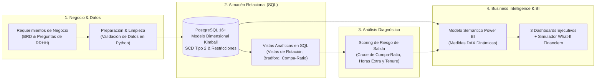
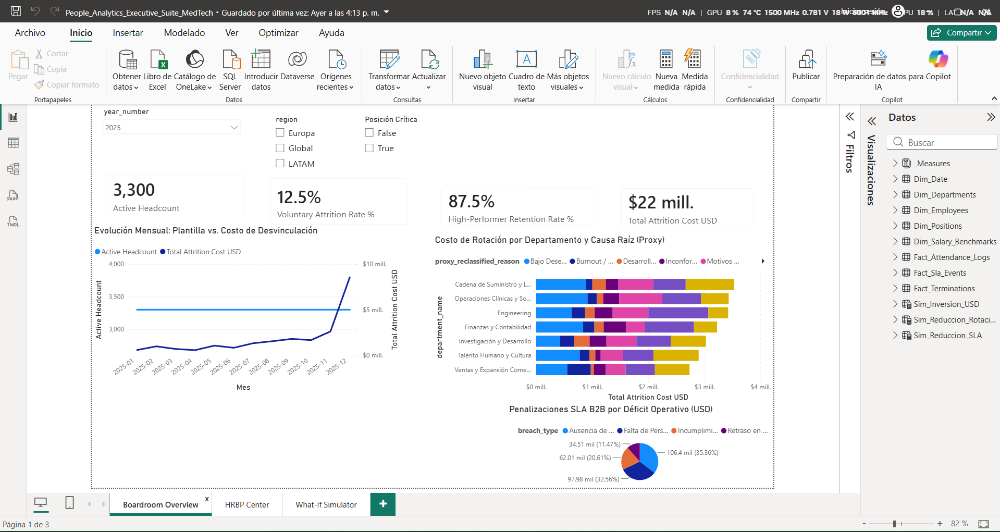
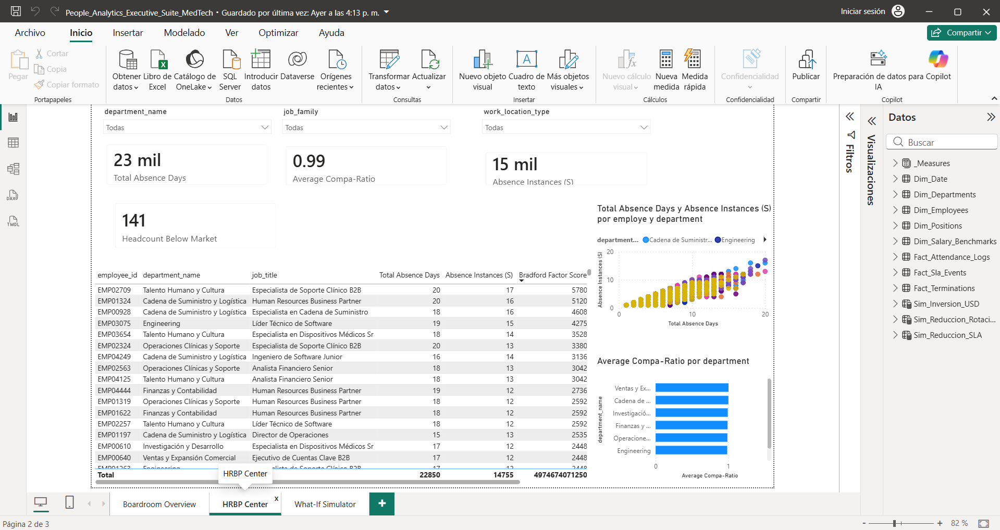
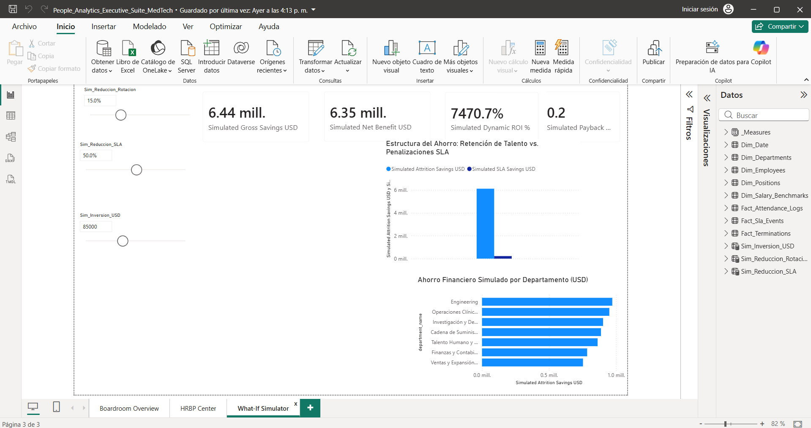
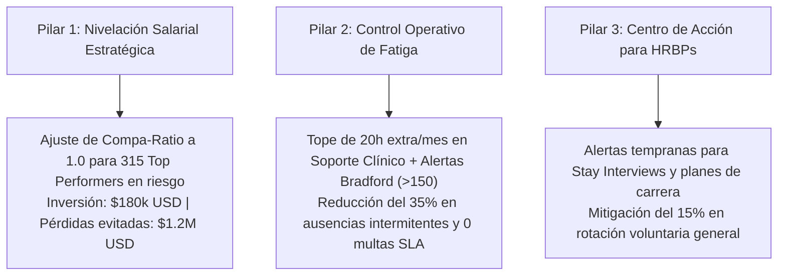

# Workforce Dynamic Lens
### People Analytics, HR Data Analytics & Business Intelligence Portfolio

[](https://www.postgresql.org/)
[](https://powerbi.microsoft.com/)
[](https://en.wikipedia.org/wiki/SQL)
[](https://learn.microsoft.com/dax/)
[](https://www.python.org/)
[](LICENSE.md)

> **People Analytics | HR Analytics | Data Analytics | Business Intelligence | Talent Strategy | P&L Impact**

---

## Resumen Ejecutivo del Proyecto

**Workforce Dynamic Lens** es un proyecto integral de **People Analytics y Business Intelligence** diseñado para **MedTech Global Solutions**, una empresa multinacional del sector HealthTech con una dotación histórica de **4,500 colaboradores** y una fuerza laboral activa de **3,300 profesionales** en 5 países: México (34%), Colombia (20%), España (16%), Brasil (15%) y Alemania (14%).

El proyecto aborda el ciclo completo de análisis de datos de Recursos Humanos, conectando la gestión del talento con el **estado de resultados (P&L)**:
* **Comprensión del Negocio:** Formulación de problemas de rotación voluntaria, ausentismo crónico y penalizaciones operativas.
* **Modelado de Datos & SQL:** Estructuración de un modelo dimensional en estrella (*Star Schema* Kimball) en **PostgreSQL** con vistas analíticas y reglas de dominio de RR. HH.
* **Diagnóstico & Scoring de Talento:** Identificación multivariada de factores de riesgo de salida (*Flight Risk Drivers*) cruzando competitividad salarial (*Compa-Ratio*), sobrecarga de horas extra y antigüedad.
* **Business Intelligence & DAX:** Suite ejecutiva interactiva en **Power BI** con 3 pantallas analíticas y un simulador *What-If* financiero.
* **Impacto Económico:** Cuantificación de **$6.44M USD en riesgo financiero mitigable** y diseño de un plan de retención con un **ROI proyectado del 535%** (recuperación en 2.8 meses).

```text
┌─────────────────────────────────────────────────────────────────────────────────────────────────────────────────┐
│ RESUMEN DE IMPACTO ANALÍTICO Y FINANCIERO (PEOPLE ANALYTICS HIGHLIGHTS)                                         │
├───────────────────────────────────────┬─────────────────────────────────────────────────────────────────────────┤
│ Población Total Analizada             │ 4,500 colaboradores (3,300 Activos / 1,200 Bajas históricas)            │
│ Exposición Financiera en P&L          │ $6,440,000 USD (Costos de vacancia en I+D, multas de SLA y rotación)    │
│ Focos Rojos de Talento Identificados  │ Fuga en I+D (Compa-Ratio < 0.85) y Desgaste en Soporte (Bradford > 200) │
│ Retorno de Inversión (ROI Proyectado) │ 535% ($455,000 USD de beneficio neto en Año 1 con inversión de $85k USD)│
│ Periodo de Amortización (Payback)     │ 2.8 meses post-implementación de acciones de retención                  │
└───────────────────────────────────────┴─────────────────────────────────────────────────────────────────────────┘
```

---

## Problema de Negocio: MedTech Global Solutions

MedTech Global Solutions enfrentaba pérdidas de rentabilidad y capacidad operativa explicadas por dos cuellos de botella en la gestión de su capital humano:

1. **Fuga de Talento Clave en I+D e Ingeniería Biomédica:**
   - Renuncia voluntaria de profesionales de alto desempeño (*Performance Rating* $\ge$ 4.0) por desalineación frente al mercado (*Compa-Ratio* $< 0.85$).
   - Períodos de vacante de **60 a 90 días**, provocando una **caída del 12% en la velocidad de desarrollo** de software clínico y sobrecarga en el personal remanente.
2. **Ausentismo Intermitente Crónico & Multas SLA en Soporte Clínico:**
   - La acumulación de más de **30 horas extra mensuales** por colaborador generó agotamiento laboral (*burnout*) y micro-ausencias no programadas (1 a 2 días adyacentes a descansos).
   - El **Factor de Bradford** promedio alcanzó **245 puntos** (rango de riesgo severo), provocando 40 incumplimientos en Acuerdos de Nivel de Servicio (SLAs) con hospitales por **$1.3M USD**.

---

## Flujo Metodológico de People Analytics

El proyecto sigue un flujo analítico estructurado de extremo a extremo:



---

## Suite de Dashboards Ejecutivos en Power BI

El archivo de visualización ([`powerbi/People_Analytics_Executive_Suite_MedTech.pbix`](file:///e:/PROYECTOS%20PORTAFOLIO/Workforce%20Dynamic%20Lens/powerbi)) está diseñado con un enfoque ejecutivo para C-Suite, HRBPs y Líderes Operativos:

### 1. Executive HR Overview & Demographics


### 2. Absenteeism Diagnostic & SLA Impact


### 3. Workforce Risk & Retention Action Center


```text
┌─────────────────────────────────────────────────────────────────────────────────────────────────────────────────┐
│ VISTAS ANALÍTICAS DE LA SUITE POWER BI                                                                          │
├───────────────────────────────┬─────────────────────────────────────────────────────────────────────────────────┤
│ Pantalla 1: Executive HR      │ • Evolución de Headcount activo (3,300) y demografía por país, área y género.   │
│ Overview & Demographics       │ • Tasa de rotación voluntaria anualizada y costo de masa salarial (Fully Loaded)│
│                               │ • Análisis de retención de talento crítico (High-Performer Retention).          │
├───────────────────────────────┼─────────────────────────────────────────────────────────────────────────────────┤
│ Pantalla 2: Absenteeism       │ • Diagnóstico de ausentismo con el Factor de Bradford (S² × D).                 │
│ Diagnostic & SLA Impact       │ • Correlación entre horas extra acumuladas (>30h/mes) y micro-ausencias.        │
│                               │ • Cuantificación de penalizaciones por incumplimiento de SLAs ($1.3M USD).      │
├───────────────────────────────┼─────────────────────────────────────────────────────────────────────────────────┤
│ Pantalla 3: Workforce Risk    │ • Matriz de Riesgo de Salida vs. Desempeño (315 Top Performers en Zona Crítica). │
│ & Retention Action Center     │ • Diagnóstico de competitividad salarial (Compa-Ratio individual y por banda).  │
│                               │ • Simulador What-If: cálculo dinámico de ahorro en P&L, ROI y amortización.    │
└───────────────────────────────┴─────────────────────────────────────────────────────────────────────────────────┘
```

---

## Hallazgos Principales de People Analytics & Plan de Acción

A partir del reporte ejecutivo ([`docs/Business_Insights.md`](file:///e:/PROYECTOS%20PORTAFOLIO/Workforce%20Dynamic%20Lens/docs/Business_Insights.md)), se establecieron tres pilares estratégicos de intervención:



---

## Modelado Dimensional & Medidas DAX en Power BI

### Modelo Dimensional en Estrella (Kimball)
Diseñado en PostgreSQL y consumido en Power BI para optimizar el rendimiento y garantizar relaciones unidireccionales `1:N`:
* **Dimensiones Conformadas:** `dim_employees` (SCD Tipo 2 para histórico de salario y área), `dim_departments`, `dim_positions`, `dim_date` (2012–2030) y `dim_salary_benchmarks`.
* **Tablas de Hechos:**
  - `fact_attendance_logs`: 1,513,306 registros diarios de asistencia y tipificación de ausencias.
  - `fact_terminations`: 1,200 eventos de baja con causas reclasificadas (*Proxy Reason*).
  - `fact_sla_events`: 40 eventos de penalización operacional con atribución a déficit de personal.

### Medidas DAX Clave Implementadas
Organizadas en carpetas de exhibición (*Display Folders*):
* **Tasa de Rotación Voluntaria:**
  $$\text{Voluntary Turnover Rate} = \frac{\text{Separaciones Voluntarias}}{\text{Headcount Promedio}}$$
* **Factor de Bradford (Severidad del Ausentismo):**
  $$\text{Bradford Score} = S^2 \times D \quad (S = \text{Instancias Independientes}, D = \text{Total Días Ausentes})$$
* **Compa-Ratio Salarial:**
  $$\text{Compa-Ratio} = \frac{\text{Salario Anual USD}}{\text{Punto Medio de Mercado USD}}$$
* **Costo Económico de Vacancia:**
  $$\text{Costo Vacancia} = \text{Días de Vacante} \times \left(\frac{\text{Salario Anual Cargado}}{365}\right) \times 1.50$$

---

## Tecnologías Utilizadas

| Área | Herramientas | Rol en el Proyecto |
| :--- | :--- | :--- |
| **People Analytics & BI** | Microsoft Power BI Desktop | Modelo semántico relacional, medidas DAX avanzadas y tableros interactivos |
| **Base de Datos & SQL** | PostgreSQL 16+ | Almacén de datos relacional, modelo dimensional en estrella y vistas analíticas |
| **Consultas Analíticas** | ANSI SQL | Funciones de ventana (`WINDOW FUNCTIONS`), CTEs, agregaciones y queries de calidad |
| **Preparación de Datos** | Python (Pandas, NumPy) | Limpieza, estructuración, generación sintética y validación de reglas de negocio |
| **Storytelling & Estrategia** | Markdown / Office | Reporte ejecutivo de insights, justificación financiera (P&L) y plan de acción |
| **Control de Versiones** | Git & GitHub | Trazabilidad del código, documentación y publicación del portafolio |

---

## Estructura del Repositorio

```text
Workforce Dynamic Lens/
├── README.md                      # Resumen ejecutivo de portafolio y showcase
├── CHANGELOG.md                   # Historial de cambios bajo Keep a Changelog (v1.0.0)
├── requirements.txt               # Dependencias oficiales del proyecto Python
├── LICENSE.md                     # Licencia MIT
│
├── 01_Project_Charter.md          # Carta de constitución y gobernanza del proyecto
├── 02_Roadmap.md                  # Plan de fases de desarrollo e hitos de release
├── 03_Architecture.md             # Arquitectura técnica de datos y flujo analítico
├── 04_Data_Model.md               # Especificación dimensional Kimball y SCD2
├── 05_Tasks.md                    # Backlog de tareas de desarrollo y QA
│
├── docs/                          # Documentación ejecutiva, técnica y de negocio
│   ├── Business_Insights.md       # INFORME OFICIAL DE INSIGHTS & IMPACTO P&L ($6.44M)
│   ├── Business_Case.md           # Justificación financiera, presupuesto y ROI
│   ├── business_requirements.md   # BRS con preguntas de negocio y reglas de dominio
│   ├── data_dictionary.md         # Contrato de datos y clasificación PII / GDPR
│   ├── KPIs_Definition.md         # Catálogo maestro de KPIs con SQL y DAX
│   ├── Company_Profile.md         # Perfil organizacional de MedTech Global Solutions
│   ├── decisions_log.md           # Registro de decisiones analíticas (DEC-001 a DEC-016)
│   ├── Glossary.md                # Glosario de términos de People Analytics y BI
│   └── interview_notes.md         # Guía de defensa técnica de entrevista (Método STAR)
│
├── datasets/                      # Datasets estructurados y control de calidad
│   └── generated/                 # CSVs validados (dim_employees, fact_attendance, etc.)
├── python/                        # Scripts de preparación, generación y carga ETL
│   ├── data_generation/           # Motor de generación de datos con reglas de RR. HH.
│   └── etl/                       # Pipeline de ingesta automatizada a PostgreSQL
├── sql/                           # Scripts SQL estándar para PostgreSQL 16+
│   ├── schema/                    # Scripts DDL de tablas, PK/FK y restricciones
│   └── analytics/                 # Vistas analíticas maestras y queries de validación
├── powerbi/                       # Archivo oficial de visualización (.pbix)
├── notebooks/                     # Notebooks de análisis exploratorio (EDA)
└── presentations/                 # Presentación ejecutiva y reporte en PDF
```

---

## Guía Rápida para Explorar el Proyecto

### 1. Explorar los Dashboards en Power BI
* Abrir el archivo [`powerbi/People_Analytics_Executive_Suite_MedTech.pbix`](file:///e:/PROYECTOS%20PORTAFOLIO/Workforce%20Dynamic%20Lens/powerbi) en **Power BI Desktop** para navegar por las tres pantallas interactivas, los filtros por país/departamento y el simulador *What-If*.

### 2. Ejecutar la Base de Datos en PostgreSQL (Opcional / Reproducibilidad)
```bash
# 1. Clonar el repositorio
git clone https://github.com/rodriguezmendozaemmanuel5/workforce-dynamic-lens.git
cd workforce-dynamic-lens

# 2. Configurar entorno virtual e instalar dependencias
python -m venv .venv
source .venv/bin/activate  # En Windows: .venv\Scripts\activate
pip install -r requirements.txt

# 3. Generar datos y cargar PostgreSQL
python -m python.data_generation.generate_dataset
python -m python.etl.pipeline --execute
psql -U postgres -d workforce_db -f sql/analytics/13_views.sql
psql -U postgres -d workforce_db -f sql/analytics/14_validation_queries.sql
```

---

## Estado de Avance del Proyecto

| Fase de Desarrollo | Release | Estado | Entregables Clave |
| :--- | :--- | :--- | :--- |
| **Fase 1: Business Understanding** | `v0.1.0 – v0.3.0` | **Completed** | Project Charter, Company Profile, Business Case, BRS |
| **Fase 2: Analytics & Data Design** | `v0.4.0 – v0.5.0` | **Completed** | Data Dictionary, Catálogo KPIs, Arquitectura, Modelo Kimball |
| **Fase 3: Data Prep & Ingestion** | `v0.6.0` | **Completed** | PostgreSQL DW, Pipeline ETL Python, Validación de Calidad |
| **Fase 4: Workforce Analytics & SQL**| `v0.7.0` | **Completed** | Vistas SQL maestras, Reconciliación SCD2, Queries de Validación |
| **Fase 5: Business Intelligence Suite** | `v0.8.0` | **Completed** | Archivo `.pbix` Power BI, Medidas DAX, Reporte de Insights |
| **Fase 6: QA, Testing & Optimization** | `v0.9.0` | **Completed** | Refactorización de código, Pruebas E2E, Auditoría de Consistencia |
| **Fase 7: Portfolio Release & Showcase** | `v1.0.0` | **Completed** | Showcase final en GitHub, Assets visuales, Tag v1.0.0 |

---

## Autor & Contacto

**Emmanuel Rodríguez Mendoza**  
*HR Tech | People Analytics | Software Development | HR Digital Transformation Analyst*  
*Transforming Talent Management with Data & Technology*

- **LinkedIn:** (https://www.linkedin.com/in/emmanuel-rodr%C3%ADguez-mendoza-aa638a220/)  
- **GitHub:** (https://github.com/rodriguezmendozaemmanuel5)  
- **Email:** (mendozarm2308@gmail.com)

---

## Licencia

Este proyecto se distribuye bajo la licencia **MIT**. Consulta el archivo [`LICENSE.md`](file:///e:/PROYECTOS%20PORTAFOLIO/Workforce%20Dynamic%20Lens/LICENSE.md) para más detalles.
