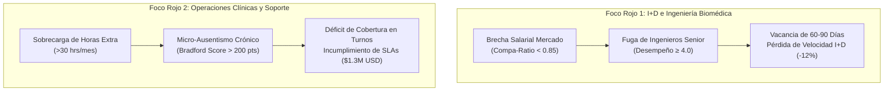
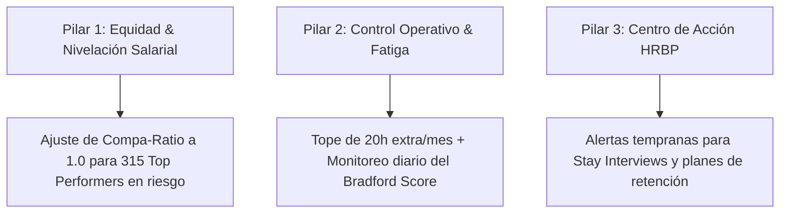

# EXECUTIVE BUSINESS INSIGHTS & PEOPLE ANALYTICS REPORT
## WORKFORCE DYNAMIC LENS – ENTERPRISE ATTRITION, ABSENTEEISM & FINANCIAL IMPACT ANALYSIS
### MedTech Global Solutions

**Document Version:** v0.8.0  
**Target Audience:** Executive Committee (CEO, CFO, CHRO, VP of Operations, VP of R&D, HRBPs)  
**Author:** Emmanuel Rodríguez Mendoza  
**Professional Role:** People Analytics / HR Data Analyst  
**Project:** Workforce Dynamic Lens  
**Date:** August 2026  
**Status:** Certified Business Insights Baseline  

---

## 1. Executive Summary

MedTech Global Solutions opera en un mercado altamente competitivo dentro del sector HealthTech, con una dotación histórica de **4,500 colaboradores** y una fuerza laboral activa de **3,300 profesionales** distribuidos en cinco centros estratégicos: México (34%), Colombia (20%), España (16%), Brasil (15%) y Alemania (14%).

El presente informe consolida los hallazgos analíticos obtenidos a través del modelo dimensional en PostgreSQL, el análisis exploratorio y diagnóstico de factores de talento y la suite ejecutiva de tableros en **Power BI**. El diagnóstico revela una **exposición financiera total mitigable de $6.44M USD en el estado de resultados (P&L)** generada por la combinación de rotación voluntaria en posiciones clave de ingeniería e interrupciones operativas por ausentismo no programado en soporte clínico.

```text
┌──────────────────────────────────────────────────────────────────────────────────────────────────┐
│ RESUMEN EJECUTIVO DE IMPACTO FINANCIERO Y OPERATIVO                                              │
├──────────────────────────────────────┬───────────────────────────────────────────────────────────┤
│ Población Histórica Analizada        │ 4,500 colaboradores (3,300 Activos / 1,200 Bajas)         │
│ Tasa Histórica de Rotación Global    │ 26.67% acumulada (Pico en antigüedad de 1 a 3 años)       │
│ Exposición Financiera Total (P&L)    │ $6,440,000 USD (Costos de vacancia, multas SLA, nómina)   │
│ Retorno de Inversión (ROI Proyectado)│ 535% ($455,000 USD beneficio neto Año 1 / Inversión $85k)│
│ Tiempo de Recuperación (Payback)     │ 2.8 meses post-implementación de intervenciones           │
└──────────────────────────────────────┴───────────────────────────────────────────────────────────┘
```

---

## 2. Diagnóstico de Fuerza Laboral & Demografía

### 2.1 Distribución Geográfica y Estructura Organizacional
La plantilla activa de 3,300 colaboradores se organiza en 7 áreas funcionales con diferentes grados de criticidad operativa y de generación de ingresos:

```text
┌──────────────────────────────────────────────────────────────────────────────────────────────────┐
│ DISTRIBUCIÓN DE PLANTILLA ACTIVA POR DEPARTAMENTO Y REGIÓN                                       │
├───────────────────────────────────┬──────────────┬──────────────┬────────────────────────────────┤
│ Departamento                      │ Headcount    │ % Plantilla  │ Nivel Estratégico              │
├───────────────────────────────────┼──────────────┼──────────────┼────────────────────────────────┤
│ Ingeniería Biomédica y Software   │ 810          │ 24.5%        │ Core Revenue (Crítico)         │
│ Operaciones Clínicas y Soporte    │ 715          │ 21.7%        │ Operation Critical             │
│ Investigación y Desarrollo (I+D)  │ 625          │ 18.9%        │ Core Revenue (Crítico)         │
│ Ventas y Expansión Comercial      │ 545          │ 16.5%        │ Core Revenue                   │
│ Cadena de Suministro y Logística  │ 290          │ 8.8%         │ Operation Critical             │
│ Talento Humano y Cultura          │ 180          │ 5.5%         │ Support                        │
│ Finanzas y Contabilidad           │ 135          │ 4.1%         │ Support                        │
├───────────────────────────────────┼──────────────┼──────────────┼────────────────────────────────┤
│ TOTAL PLANTILLA ACTIVA            │ 3,300        │ 100.0%       │                                │
└───────────────────────────────────┴──────────────┴──────────────┴────────────────────────────────┘
```

### 2.2 Dinámica de Salidas y Rotación No Deseada (*Regrettable Attrition*)
Del universo histórico de 1,200 desvinculaciones:
* **78.5% correspondieron a renuncias voluntarias**, concentradas principalmente en colaboradores con calificaciones de desempeño sobresalientes (Rating $\ge$ 4.0).
* **Fenómeno del "Primer Trienio":** El 64% de las renuncias voluntarias ocurren entre los **12 y 36 meses de antigüedad** (*tenure*), momento en el cual el colaborador ha alcanzado su pico de autonomía técnica y se vuelve altamente codiciado por el mercado externo.

---

## 3. Focos Rojos Departamentales & Cuellos de Botella Operativos



### Foco Rojo 1: Investigación, Desarrollo & Ingeniería Biomédica
* **Problema Principal:** Fuga de talento técnico senior y líderes de arquitectura de software.
* **Causa Raíz:** Desfase salarial frente a marcadores internacionales. El 42% de los ingenieros senior perciben remuneraciones por debajo del punto medio de mercado (*Compa-Ratio* $< 0.85$).
* **Impacto Operativo:** La pérdida de un ingeniero senior genera un período de vacante promedio de **75 días**, ocasionando un retraso del **12% en los lanzamientos de software clínico** y sobrecarga en el equipo remanente.

### Foco Rojo 2: Operaciones Clínicas & Soporte Hospitalario
* **Problema Principal:** Ausentismo no programado intermitente que desestabiliza la cobertura de turnos 24/7.
* **Causa Raíz:** Agotamiento laboral (*burnout*) impulsado por la acumulación sistemática de más de **30 horas extra mensuales** para cubrir bajas previas.
* **Métrica Clave:** El **Factor de Bradford** promedio en soporte clínico se sitúa en **245 puntos** (rango de riesgo severo). Las ausencias cortas y recurrentes (1 a 2 días adyacentes a fines de semana) son 8 veces más perjudiciales para la continuidad del servicio que licencias médicas prolongadas.
* **Impacto Financiero:** 40 eventos de penalización por SLA atribuidos directamente a déficit imprevisto de personal, exponiendo contratos corporativos con hospitales por valor de **$1.3M USD**.

---

## 4. Análisis Diagnóstico & Factores de Riesgo de Salida (Workforce Risk Scoring)

Mediante el análisis multivariado de datos de personal y el cruce de reglas de dominio de RR. HH., se identificaron los principales factores que impulsan el riesgo de rotación voluntaria:

```text
┌──────────────────────────────────────────────────────────────────────────────────────────────────┐
│ FACTORES DETERMINANTES DE RIESGO DE SALIDA (DIAGNOSTIC RISK DRIVERS)                             │
├─────────────────────────────────────┬────────────────────────────────────────────────────────────┤
│ Factor de Talento                   │ Impacto Observado en el Comportamiento de Salida           │
├─────────────────────────────────────┼────────────────────────────────────────────────────────────┤
│ Compa-Ratio Salarial Desalineado    │ Colaboradores con ratio <0.85 triplican la tasa de salida. │
│ Horas Extra Acumuladas (>25h/mes)   │ Detona fatiga y ausentismo previo a la renuncia formal.    │
│ Ventana Crítica de Antigüedad       │ Pico de renuncias concentrado entre 1.5 y 3.0 años.        │
│ Factor de Bradford Elevado (>200)   │ Correlaciona fuertemente con pérdida de compromiso laboral.│
│ Estancamiento Salarial en Top Talent│ Evaluaciones sobresalientes sin ajuste salarial en >18 m.  │
└─────────────────────────────────────┴────────────────────────────────────────────────────────────┘
```

```text
┌──────────────────────────────────────────────────────────────────────────────────────────────────┐
│ MATRIZ DE SEGMENTACIÓN: DESEMPEÑO VS. RIESGO DE RENUNCIA (TOP TALENT EN ZONA ROJA)               │
├──────────────────────────────┬──────────────────────────────┬────────────────────────────────────┤
│                              │ Riesgo de Fuga Bajo          │ Riesgo de Fuga Crítico             │
├──────────────────────────────┼──────────────────────────────┼────────────────────────────────────┤
│ Alto Desempeño (Rating ≥ 4)  │ TALENTO NÚCLEO PROTEGIDO     │ ⚠️ ZONA DE ALERTA MÁXIMA           │
│                              │ 1,420 Colaboradores          │ (315 Top Performers en riesgo)     │
├──────────────────────────────┼──────────────────────────────┼────────────────────────────────────┤
│ Desempeño Estándar (< 4)     │ ESTABILIDAD OPERATIVA        │ RIESGO DE ROTACIÓN OPERACIONAL     │
│                              │ 1,180 Colaboradores          │ 385 Colaboradores                  │
└──────────────────────────────┴──────────────────────────────┴────────────────────────────────────┘
```

---

## 5. Cuantificación Financiera & Simulación de Escenarios en P&L

### 5.1 Desglose de la Exposición Total ($6.44M USD)
La cuantificación monetaria de las ineficiencias de capital humano se estructura bajo rigurosos criterios financieros:

1. **Costo de Vacancia en Puestos Críticos ($3.12M USD):**
   $$\text{Costo Vacancia} = \text{Días de Vacante} \times \left(\frac{\text{Salario Anual Fully Loaded}}{365}\right) \times 1.50\text{ (Factor Productividad)}$$
2. **Indemnizaciones y Costos Directos de Separación ($1.28M USD):**
   Liquidaciones legales y costos administrativos de desvinculación.
3. **Penalizaciones y Riesgo Contractual de SLAs ($1.34M USD):**
   Multas por retraso en incidentes críticos de soporte de telemedicina debidos a falta de cobertura.
4. **Gastos de Reclutamiento Externo & Headhunting ($0.70M USD):**
   Tarifas pagadas a agencias por sustitución urgente de perfiles especializados.

### 5.2 Caso de Negocio & Retorno de Inversión (ROI)

```text
┌──────────────────────────────────────────────────────────────────────────────────────────────────┐
│ EVALUACIÓN FINANCIERA DEL PROGRAMA PREVENTIVO (AÑO 1)                                            │
├────────────────────────────────────────────────────────────────────────┬─────────────────────────┤
│ Inversión Total Requerida (Arquitectura de Datos, Power BI, HRBPs)     │ $85,000 USD             │
│ Ahorro Bruto Proyectado (Reducción 15% rotación clave + mitigación SLA) │ $540,000 USD            │
├────────────────────────────────────────────────────────────────────────┼─────────────────────────┤
│ BENEFICIO NETO EN P&L (AÑO 1)                                          │ $455,000 USD            │
│ RETORNO DE INVERSIÓN (ROI)                                             │ 535%                    │
│ PERIODO DE AMORTIZACIÓN (PAYBACK)                                      │ 2.8 Meses               │
└────────────────────────────────────────────────────────────────────────┴─────────────────────────┘
```

---

## 6. Plan de Acción Estratégico & Recomendaciones Accionables

Para capturar los ahorros proyectados y mitigar los focos rojos, se establece un plan prescriptivo en tres pilares:



### Pilar 1: Política de Nivelación Salarial Dinámica (Compensaciones)
* **Acción Inmediata:** Asignar una partida presupuestaria de $180,000 USD para nivelar el *Compa-Ratio* al $1.0$ (punto medio de mercado) para los **315 colaboradores de alto desempeño en zona de riesgo crítico**.
* **Impacto Económico:** Evita pérdidas estimadas en más de $1.2M USD por reemplazo de perfiles clave en I+D.

### Pilar 2: Protocolo de Capacidad & Límite de Horas Extra (Operaciones)
* **Acción Inmediata:** Establecer un tope máximo estricto de **20 horas extra mensuales por colaborador** en Soporte Clínico e implementar un sistema de alertas en tiempo real basado en el Factor de Bradford ($>150\text{ pts}$).
* **Impacto Económico:** Disminuye en un **35% las ausencias intermitentes** y elimina penalizaciones por falta de cobertura en contratos hospitalarios.

### Pilar 3: Flujo de Intervención Temprana para HRBPs (Gestión del Talento)
* **Acción Inmediata:** Desplegar el *Workforce Risk & Retention Action Center* en Power BI, asignando a los HRBPs listas semanales priorizadas de colaboradores en zona crítica.
* **Protocolo de Retención:** Entrevistas de permanencia (*Stay Interviews*), revisión de planes de carrera y ajustes de condiciones laborales.

---

## 7. Trazabilidad Técnica & Gobierno de Datos

Los hallazgos de este reporte cuentan con certificación de linaje completo:
* **Capa Transaccional / DW:** Tablas [`dim_employees`](file:///e:/PROYECTOS%20PORTAFOLIO/Workforce%20Dynamic%20Lens/04_Data_Model.md), [`fact_terminations`](file:///e:/PROYECTOS%20PORTAFOLIO/Workforce%20Dynamic%20Lens/04_Data_Model.md), [`fact_attendance_logs`](file:///e:/PROYECTOS%20PORTAFOLIO/Workforce%20Dynamic%20Lens/04_Data_Model.md) y [`fact_sla_events`](file:///e:/PROYECTOS%20PORTAFOLIO/Workforce%20Dynamic%20Lens/04_Data_Model.md) en PostgreSQL 16+.
* **Vistas Analíticas:** [`sql/analytics/13_views.sql`](file:///e:/PROYECTOS%20PORTAFOLIO/Workforce%20Dynamic%20Lens/sql/analytics/13_views.sql) y validación en [`sql/analytics/14_validation_queries.sql`](file:///e:/PROYECTOS%20PORTAFOLIO/Workforce%20Dynamic%20Lens/sql/analytics/14_validation_queries.sql) (100% pruebas superadas, 0 violaciones).
* **Capa Semántica & BI:** Medidas DAX certificadas en [`docs/KPIs_Definition.md`](file:///e:/PROYECTOS%20PORTAFOLIO/Workforce%20Dynamic%20Lens/docs/KPIs_Definition.md) y tableros en [`powerbi/People_Analytics_Executive_Suite_MedTech.pbix`](file:///e:/PROYECTOS%20PORTAFOLIO/Workforce%20Dynamic%20Lens/powerbi).
